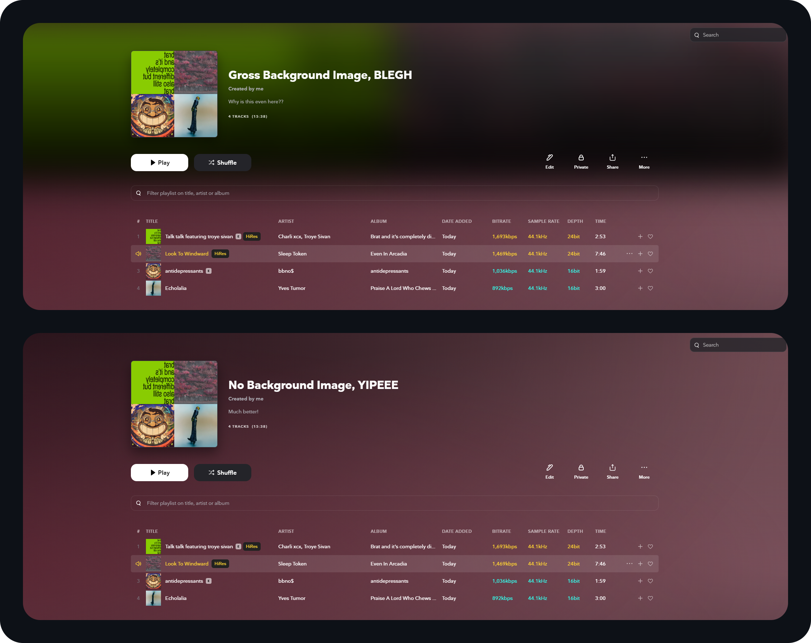

# 🧼 TIDAL Clear Coat
Quality of life tweaks for Tidal using TidaLuna themes.\
They're really just for me, but you can use them if you want :)

## 🛠️ How to Install
1. Get [TidaLuna](https://github.com/Inrixia/TidaLuna).
2. Navigate to `Luna Settings > Themes`.
3. Paste the theme link into the `Install From URL` box.

## 🧊 No Playlist Background Image
Removes the gross background image from the playlist header tab for a less cluttered look.
### 📋 **Theme URL:**
```
https://github.com/SuperslowJelly/TIDAL-Clear-Coat/raw/main/themes/no-playlist-background-image.css
```

