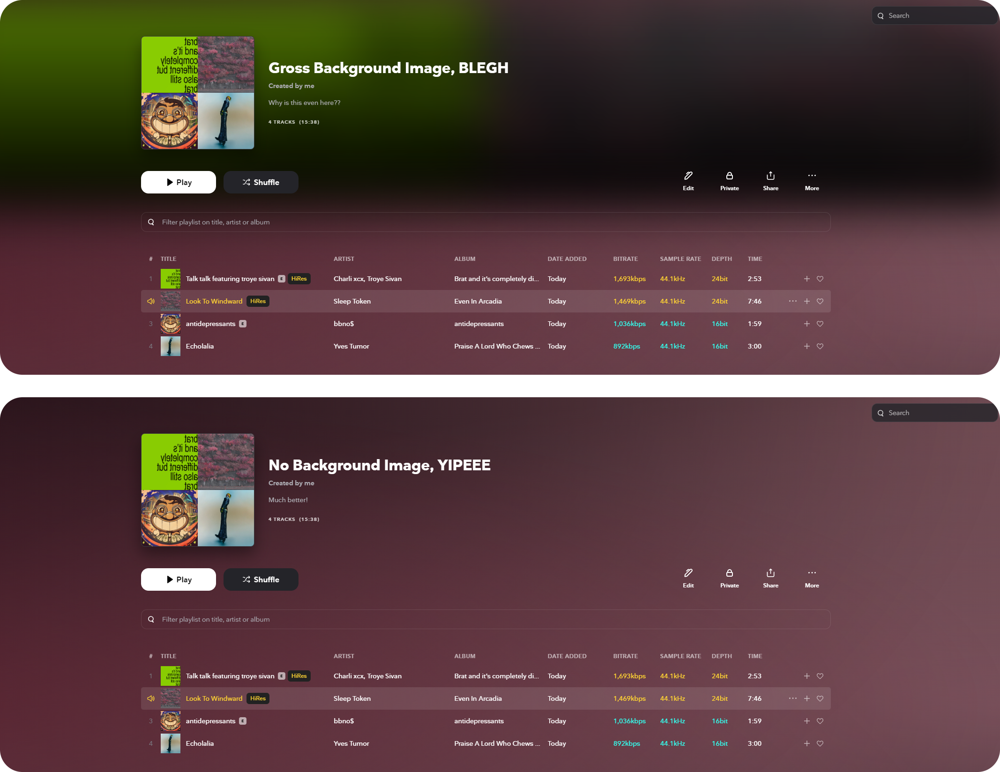

# 🧊 No Playlist Background Image
Removes the gross background image from the playlist header tab for a less cluttered look.
### 📋 **Plugin URL:**
```
https://raw.githubusercontent.com/SuperslowJelly/TIDAL-Clear-Coat/refs/heads/main/plugins/NoPlaylistBackgroundImage/package.json
```

